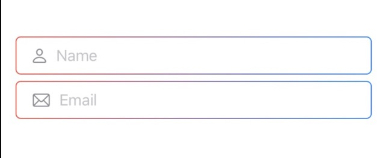

# Custom TextField Style Challenge 
This repo describes how to make a custom TextField style, which you can apply to any text field.
It is in response to the wonderful iOS design course's Module 1 Challenge 5 from CodeWithChris:
https://learn.codewithchris.com/courses/take/design/texts/25883395-lesson-5-challenge

Shows you how to create a re-useable style like the below to apply to your TextFields


## Custom TextField Style
Define a custom TextField style including the name of a system image in a separate file, e.g.
`GradientTextFieldBackground.swift`:
```
import SwiftUI

struct GradientTextFieldBackground: TextFieldStyle {
    
    let systemImageString: String
    
    // Hidden function to conform to this protocol
    func _body(configuration: TextField<Self._Label>) -> some View {
        ZStack {
            RoundedRectangle(cornerRadius: 5.0)
                .stroke(
                    LinearGradient(
                        colors: [
                            .red,
                            .blue
                        ],
                        startPoint: .leading,
                        endPoint: .trailing
                    )
                )
                .frame(height: 40)
            
            HStack {
                Image(systemName: systemImageString)
                // Reference the TextField here
                configuration
            }
            .padding(.leading)
            .foregroundColor(.gray)
        }
    }
}
``` 

## Call Custom TextField Style
You use the `.textFieldStyle` modifier on the TextField in order to deploy this custom
background for the TextField:
```
struct ContentView: View {
    
    @State var name = ""
    @State var email = ""
    
    var body: some View {
        VStack {
            // MARK: - Name TextField
            TextField("Name", text: $name)
                .textFieldStyle(
                    GradientTextFieldBackground(
                        systemImageString: "person"
                    )
                )
            
            // MARK: Email TextField
                TextField("Email", text: $email)
                    .textFieldStyle(
                        GradientTextFieldBackground(
                            systemImageString: "envelope"
                        )
                    )
        }
        .padding()
    }
}
```

